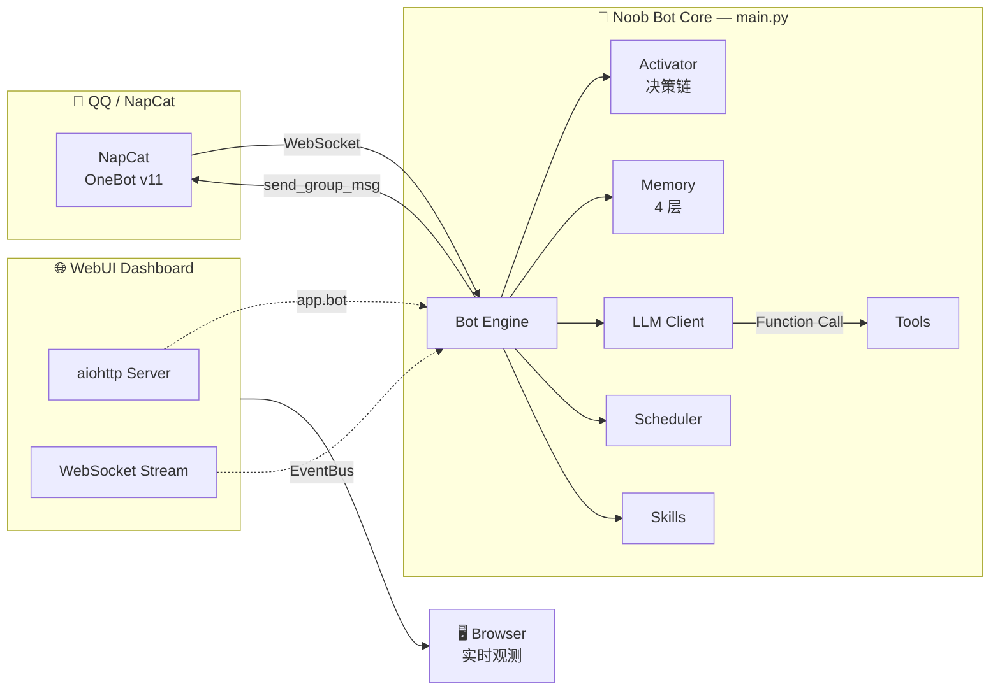

<div align="center">


<br>

<a href="https://www.python.org/"></a>
<a href="#"></a>
<a href="#"></a>
<a href="#"></a>
<a href="LICENSE"></a>
<a href="https://github.com/ninepoin4-ops/NoobBot/stargazers"></a>

<br>


<br>

**一个带 WebUI 控制面板的 QQ 群聊 AI Bot** · 思维链实时观测 · 配置热更新 · 四层记忆系统

**解压即用 · 下载 → `install.bat` → `start.bat` → 浏览器打开 WebUI**

<br>


</div>

---

## 📊 系统状态面板

```diff
+ ⚙️  Core Engine ......... ONLINE
+ 🧠  Memory Layer ........ ACTIVE  (Buffer · Vector · LoreBook · Compressor)
+ 💭  Thought Stream ...... STREAMING
+ 🔧  Tool Calling ........ READY   (search · weather · remind · time)
+ 🎯  Skills .............. LOADED  (sheng_tu · group_report)
+ 🌐  WebUI Dashboard ..... http://127.0.0.1:8081
```

---

## ✨ 核心功能 / Features

| 模块 | 状态 | 描述 |
|---|:---:|---|
| 🧠 **四层记忆系统** | ✅ | 短期 Buffer · 长期向量记忆(Chroma) · 世界书 LoreBook · 上下文压缩 |
| 💭 **思维链实时观测** | ✅ | WebUI 实时展示 `消息 → 决策 → 工具 → 回复` 全流程 |
| ⚙️ **智能热更新** | ✅ | 冷却/限流/别名即时生效；LLM 配置一键重建；连接类提示重启 |
| 👥 **群聊管理** | ✅ | 黑名单模式，按群启停；禁用群完全静默 |
| 🧠 **记忆管理** | ✅ | 短期记忆按群查看/清理；长期记忆语义搜索/删除 |
| 🎯 **技能系统** | ✅ | 关键词触发；触发词 WebUI 热改（无需改代码）；内置生图/群日报 |
| 🔧 **工具调用** | ✅ | OpenAI Function Calling；LLM 自主决策调用 |
| 📊 **仪表盘** | ✅ | 连接状态/调度任务/活跃群/记忆统计 |
| 🖥️ **零依赖前端** | ✅ | 原生 HTML/CSS/JS；Linear 浅色风格；离线可用 |

---

## 🏗️ 架构 / Architecture



> **零 IPC 设计**：WebUI 与 Bot 同进程同 event loop，所有状态内存直读，无序列化/反序列化开销。

---

## 🚀 快速开始 / Quick Start

### 环境要求

| 依赖 | 版本 | 说明 |
|---|---|---|
| Python | 3.10+ | 主运行时 |
| QQ NT | 最新版 | PC 版 QQ（NapCat 注入目标） |
| NapCat | 任意 Release | OneBot 协议端，需单独下载 |

### 3 步启动

```bash
# 1️⃣ 克隆仓库
git clone https://github.com/ninepoin4-ops/NoobBot.git
cd NoobBot

# 2️⃣ 首次安装（或双击 install.bat）
pip install -r requirements.txt
playwright install chromium    # 群日报图片渲染用

# 3️⃣ 启动（双击 start.bat）
#    按提示扫码登录 QQ → 登录完成按任意键 → Bot + WebUI 自动启动
```

启动后浏览器访问：

```
🌐 http://127.0.0.1:8081
```

<details>
<summary>📖 详细配置说明</summary>

#### 放置 NapCat
- 下载 [NapCat](https://github.com/NapNeko/NapCatQQ) Release
- 解压到项目根目录的 `napcat/` 文件夹（确保 `napcat/napcat/launcher-user.bat` 存在）

#### 配置 API Key
编辑 `config/.env`：
```
LLM_API_KEY_HASH=<你的 DeepSeek key 去掉 sk- 前缀>
```
或直接在 `config/config.yaml` 的 `llm.api_key` 填完整 key。

</details>

---

## 🖥️ WebUI 控制面板

启动后访问 `http://127.0.0.1:8081`，7 个功能页：

| 页面 | 功能 |
|---|---|
| 📊 **仪表盘** | 在线状态 · 模块概览 · 调度任务 · 记忆统计 |
| 👥 **群聊** | 按群启停（黑名单模式）· 群信息一览 |
| 💭 **思维链** | 实时事件流：消息 → 决策 → 工具 → 回复 |
| ⚙️ **配置** | 表单编辑 · 三色标签（热生效/需重建/需重启） |
| 🧠 **记忆** | 短期查看/清理 · 长期语义搜索/删除 |
| 🎯 **技能** | 启停 · 触发词热改 · 即时生效 |
| 🔧 **工具** | 开关 · schema 查看 · 即时生效 |

### 配置热更新策略

| 标签 | 含义 | 示例 |
|:---:|---|---|
| 🟢 **热生效** | 改完立即应用 | bot 名称、冷却时间、限流、别名、工具开关 |
| 🟠 **需重建** | 点「重建 LLM 客户端」生效 | model、api_key、temperature |
| 🔴 **需重启** | 重启 Bot 进程生效 | napcat 连接、webui 端口、记忆轮数 |

所有改动自动持久化到 `config/config.yaml`。

---

## 📦 项目结构

```
noobbot/
├── main.py                  # 入口（Bot + WebUI 同进程）
├── start.bat                # 一键启动
├── install.bat              # 首次安装
├── config/
│   ├── config.yaml          # 主配置
│   └── .env                 # API key（不入 git）
├── src/
│   ├── bot.py               # 主调度器
│   ├── napcat/client.py     # OneBot v11 客户端
│   ├── engine/
│   │   ├── activator.py     # 决策链 + 群黑名单
│   │   └── scheduler.py     # 定时任务
│   ├── memory/manager.py    # 四层记忆
│   ├── llm/client.py        # LLM + 人格 prompt
│   └── tools/registry.py    # 工具注册
├── skills/                  # 技能系统
│   ├── sheng_tu.py          # 生图
│   └── group_report/        # 群日报
└── webui/                   # WebUI 控制面板
    ├── server.py            # aiohttp 入口
    ├── events.py            # 事件总线
    ├── hot_reload.py        # 热更新
    ├── handlers/            # API handlers
    └── static/              # 前端 SPA
```

---

## 🎭 默认人格

默认人格为 **小白** —— 一个可爱的 AI 助手：

```
温柔 · 热情 · 俏皮 · 亲切自然
偶尔卖萌 · 善用颜文字 (｡•̀ᴗ-)✧
```

人格定义在 `src/llm/client.py` 的 `generate_system_prompt()`，Bot 角色名可在 WebUI 或 `config.yaml` 修改。

---

## ⚙️ 核心配置

| 配置项 | 默认 | 说明 |
|---|---|---|
| `bot.name` | `小白` | Bot 角色名（人设） |
| `llm.model` | `deepseek-chat` | LLM 模型 |
| `llm.temperature` | `0.8` | 温度（越高越随机） |
| `engagement.random_reply_frequency` | `0.08` | 随机插话概率 |
| `engagement.bot_names` | `[小白]` | 触发回复的别名 |
| `engagement.disabled_groups` | `[]` | 群黑名单（空=全启用） |
| `cooldown.global_cooldown` | `3` | 全局冷却（秒） |
| `cooldown.rate_limit.max_count` | `20` | 每群每分钟最大回复 |
| `webui.port` | `8081` | WebUI 端口 |

> 💡 大部分配置可在 WebUI「配置」页实时修改。

---

## 🗺️ Roadmap

```diff
+ ✅ WebUI 控制面板（7 页）
+ ✅ 思维链实时观测
+ ✅ 群聊黑名单管理
+ ✅ 配置热更新（三色策略）
+ ✅ 四层记忆系统
+ ✅ 技能触发词热改
- 🚧 Buffer 记忆持久化（SQLite）
- 🚧 WebUI 密码认证（可选）
- 🚧 流式 LLM 输出（token 级思维链）
- 🚧 更多内置技能（语音/翻译/搜索增强）
- 💡 私聊支持
- 💡 多 Bot 实例
```

---

## 📜 参考项目 / Acknowledgements

本项目在设计与实现上参考了以下优秀开源项目：

### [NapCat / NapCatQQ](https://github.com/NapNeko/NapCatQQ)
> 基于 NTQQ 的现代化 OneBot 协议端实现。

Noob Bot 通过 NapCat 接入 QQ，使用其 OneBot v11 WebSocket 接口。NapCat 是核心运行依赖。

🌐 官网：https://napneko.github.io

### [ChatLuna](https://github.com/ChatLunaLab/chatluna)
> 多平台大模型接入插件，可扩展，支持多种输出格式。

Noob Bot 的设计灵感来源：
- **活跃决策链** — 参考 `allow_reply.ts` 决策树
- **四层记忆架构** — BufferMemory → VectorMemory → LoreBook → Compressor
- **LoreBook 世界书** — 关键词触发设定注入
- **上下文压缩** — `infinite_context.ts` → `compressIfNeeded()`

📖 文档：https://chatluna.chat

---

## 📄 License

[MIT License](LICENSE) — 本项目仅供学习交流使用。

## ⚠️ 免责声明

本项目仅供学习和个人使用。使用时请遵守 [QQ 用户协议](https://rules.qq.com/)、相关法律法规及 API 服务商条款。作者不对使用本项目造成的任何后果负责。

---

<div align="center">

**如果这个项目对你有帮助，欢迎 ⭐ Star 支持一下！**


</div>
